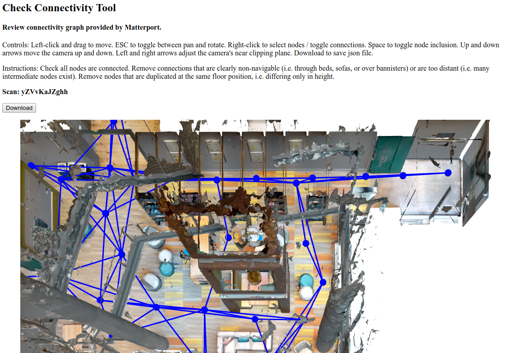

From the top-level directory, run:
```
python -m SimpleHTTPServer
```

In a browser, navigate to `http://localhost:8000/check-connectivity/connectivity.html` If you followed the previous steps, including downloading the MatterPak Bundle and setting the correct values in `web/config.json`, you should see something like this:



(With minor mods this is also a pretty good way of generating images of floorplans and navigation graphs.) Follow the instructions to clean up the connectivity graph, then click the button to download the json file. Copy it to the `data/connectivity` directory. 
